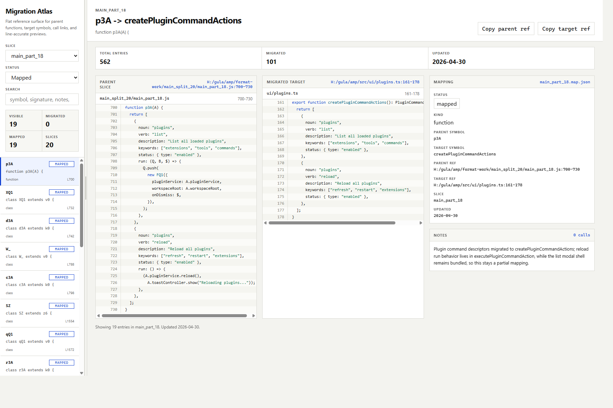

# migration-skill

A skill for reverse-engineering and bundle-to-`src` migration work.

It packages the workflow for:

- maintaining `*.map.json` migration ledgers
- validating and enriching entries
- refreshing target line ranges
- generating a clickable preview viewer
- serving the viewer locally for review

## Preview



## Included tools

- `scripts/enrich-map.mjs`
- `scripts/validate-map.mjs`
- `scripts/refresh-target-lines.mjs`
- `scripts/generate-viewer.mjs`
- `scripts/serve-viewer.mjs`

## Typical usage

```bash
bun scripts/generate-viewer.mjs
bun scripts/serve-viewer.mjs
```

## Structure

- `SKILL.md`: skill instructions
- `references/workflow-prompt.md`: reusable prompt template for other AI agents
- `assets/viewer/viewer-app.jsx`: React viewer source
- `scripts/`: viewer and map maintenance scripts
- `agents/openai.yaml`: agent wiring
